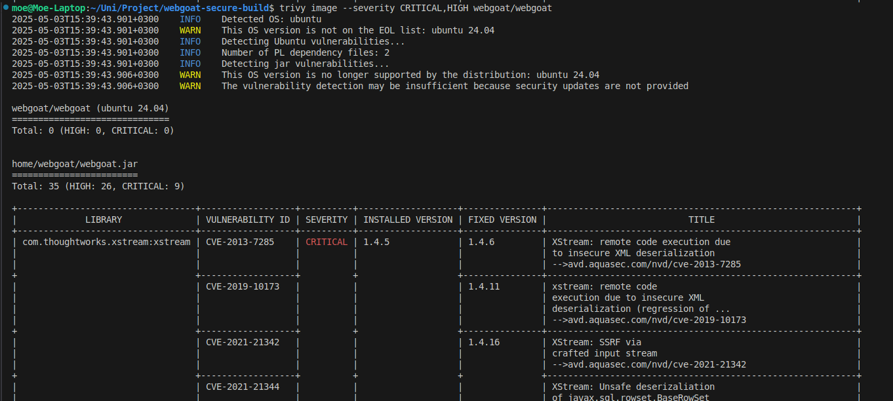

# Container Hardening and Vulnerability Scanning of WebGoat Using Trivy and Dockle

By Mohammad Jaafar
CBS-01

## Introduction

In modern DevOps practices, container security is critical to ensuring the integrity and safety of applications deployed at scale. While containers encapsulate dependencies and runtime environments, they can also package vulnerabilities and misconfigurations.

This project focuses on hardening a vulnerable containerized application—**OWASP WebGoat**—by using **Trivy** and **Dockle** to identify issues, and then systematically fixing them. I also implemented a CI/CD pipeline using GitHub Actions to automate scanning and enforce secure build standards.

---

## Approach and Implementation

### 🛠️ Container Hardening Workflow



### 2.1 Initial Vulnerability Scanning

I started by scanning the the original image (`webgoat/webgoat`) using Trivy and Dockle.

- Trivy detected multiple high and critical vulnerabilities, primarily in the `xstream` library, which is intentionally vulnerable in WebGoat to demonstrate insecure deserialization.
- **Dockle** flagged issues like the use of the `latest` tag and presence of setuid/setgid binaries.

**Table 1: Original WebGoat Image Issues (Pre-Hardening)**

| **Tool** | **Finding Type** | **Description** |
| --- | --- | --- |
| Trivy | Critical Vulnerabilities | `xstream` deserialization RCEs and SSRF, multiple CVEs flagged |
| Dockle | Best Practice Violation | Use of `latest` tag, presence of setuid/setgid binaries |



**Figure 1 - Screenshot of Trivy output for webgoat/webgoat**


**Figure 2 - Screenshot of Dockle output for webgoat/webgoat**

---


### 2.2 Dockerfile Hardening

To mitigate risks and improve security, I created two hardened Dockerfiles:

1. A Dockerfile that starts **from the official WebGoat image**, removing setuid/setgid binaries and adding a `HEALTHCHECK` instruction.
2. A fully hardened Dockerfile **from scratch using `eclipse-temurin:24-jdk-alpine`**, which:
    - Creates a non-root user
    - Uses a writable, isolated work directory
    - Disables schema generation to avoid permission issues with Hibernate
        
        (`-Dhibernate.hbm2ddl.auto=none`)
        
    - Binds WebGoat to `0.0.0.0` using `Dserver.address=0.0.0.0`
3. Avoided exposing sensitive config via environment variables by using an `entrypoint.sh` script

**Table 2: Hardening Strategies Applied:**

| **Technique** | **Description** |
| --- | --- |
| Dropped setuid/setgid | Prevents privilege escalation via system binaries |
| Non-root user | Isolates WebGoat runtime with minimal privileges |
| HEALTHCHECK | Enables container health monitoring |
| Environment Hardening | Removed risky `ENV` exposure in `ENTRYPOINT` via wrapper script |
| Hibernate auto DDL disabled | Prevents schema export in read-only environments |
| Binding to `0.0.0.0` | Ensures WebGoat is accessible from Docker container port |

### Dockerfile.patched

```docker
FROM eclipse-temurin:24-jdk-alpine

# Create app directory and user
RUN adduser -D -h /home/webgoat webgoat && \
    mkdir -p /webgoat-data && \
    chown -R webgoat:webgoat /webgoat-data

# Copy JAR and entrypoint

COPY webgoat-hardened.jar /webgoat/webgoat.jar
COPY entrypoint.sh /entrypoint.sh

# Make entrypoint executable
RUN chmod +x /entrypoint.sh

# Set ENTRYPOINT without exposing flags in Dockerfile
ENTRYPOINT ["/entrypoint.sh"]

# Set working directory to writable one
WORKDIR /webgoat-data

USER webgoat

# Expose app port
EXPOSE 8080

# Add healthcheck for Docker
HEALTHCHECK --interval=30s --timeout=10s --start-period=10s --retries=3 \
  CMD wget -q --spider http://localhost:8080/WebGoat || exit 1
```

### `entrypoint.sh`:

```bash
#!/bin/sh
exec java -Dserver.address=0.0.0.0 -Dhibernate.hbm2ddl.auto=none -jar /webgoat/webgoat.jar

```

---

### 🔁 CI/CD Pipeline (GitHub Actions)




### 2.3 CI/CD Pipeline with GitHub Actions

I automated the container security process using a GitHub Actions CI/CD workflow. This workflow:

- Triggers on push
- Builds the hardened Docker image
- Runs Trivy and Dockle scans
- Stores the scan reports (`trivy-report.json`, `dockle-report.json`) in a `reports/` directory
- Uploads reports as GitHub Actions artifacts
- Fails the build if any **CRITICAL** vulnerabilities are detected by Trivy

 **Table 3: CI/CD Pipeline Overview:**

| **Stage** | **Tool/Action Used** | **Description** |
| --- | --- | --- |
| Trigger | GitHub Actions | Runs on push and pull request events |
| Build Image | `docker build` | Builds the hardened image from patched Dockerfile |
| Vulnerability Scan | Trivy | Scans for CRITICAL and HIGH CVEs; fails build if found |
| Best Practice Scan | Dockle | Checks Dockerfile security practices; fails build on FATAL/WARN issues |
| Artifact Upload | `actions/upload-artifact@v4` | Uploads scan results (`.json` and `.txt`) for traceability |
| Security Enforcement | Exit codes | Ensures only compliant images proceed through the pipeline |


**Figure 4 - GitHub Actions pipeline with Trivy and Dockle scan results as artifacts**

---

## Results

### 3.1 Before vs. After Comparison

### Vulnerability Scanning (Trivy)

- **Before Hardening**: 37 vulnerabilities detected, many related to `xstream`
- **After Hardening**: 0 high/critical vulnerabilities detected

### Best Practices (Dockle)

- **Before**: 1 warning (latest tag), 2 info messages (setuid/setgid)
- **After**: All 16 checks passed

**Table 4: Before vs. After Comparison Summary**

| Scan Tool | Metric | Original Image | Hardened Image |
| --- | --- | --- | --- |
| Trivy | CRITICAL Vulnerabilities | 30+ (mainly `xstream`) | 0 |
| Trivy | HIGH Vulnerabilities | 10+ | 0 |
| Dockle | Warnings | 1 (`latest` tag) | 0 |
| Dockle | Informational Issues | 2 (setuid/setgid files) | 0 |

### 🔍 Before vs. After Vulnerability Comparison




**Figure 5 - Clean Trivy Report Comparison between original image and hardened image**


**Figure 6 - Clean Dockle Report Comparison between original image and hardened image**

---

## Discussion

> I found that binding the server to 0.0.0.0 was necessary for the container to expose the app correctly. Additionally, disabling Hibernate’s schema auto-generation (hibernate.hbm2ddl.auto) resolved write-access errors in the container’s read-only filesystem.
> 

> While Alpine 3.19 was incorrectly flagged as EOL by some scanners, I verified its support lifecycle via official sources and confirmed its validity through November 2025.
> 

> While the pipeline automates security scanning, the Trivy scan slowed significantly due to the large `.jar` size. Optimizing artifact size or excluding static files in scans could improve performance.
> 

This exercise reinforced best practices in secure development and showed how automated pipelines can enforce policies consistently.

---

## Conclusion

Starting from a vulnerable image, I successfully built a secure and hardened container. Through the use of automated scanning and CI/CD enforcement, I demonstrated a repeatable DevSecOps workflow. This project highlights the importance of integrating security early in the pipeline and shows how container security can be embedded directly into development practices.

---

## References

- [Trivy Documentation](https://github.com/aquasecurity/trivy)
- [Dockle Documentation](https://github.com/goodwithtech/dockle)
- [OWASP WebGoat](https://owasp.org/www-project-webgoat/)
- [Alpine Linux Lifecycle](https://alpinelinux.org/releases/)
- [Spring Boot Hibernate Schema Generation](https://docs.spring.io/spring-boot/docs/current/reference/html/application-properties.html#application-properties.data.spring.jpa.hibernate.ddl-auto)